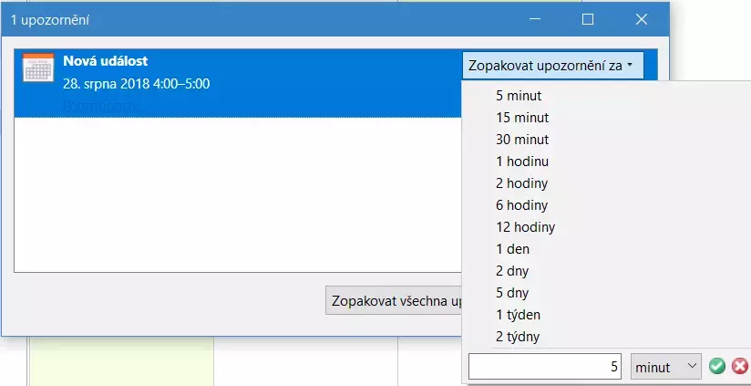

# More Snooze 

A [Thunderbird and Lightning addon](https://addons.thunderbird.net/cs/thunderbird/addon/more-snooze/) which allows to **customize the snooze times menu when snoozing calendar event alarms**.

## Compatibility Table

> [!WARNING]
> Please note that this addon is best support for the ESR release of Thunderbird (i.e. the slower, once-a-year updated version). If you're on Release channel, the addon may break with any update.

| Addon Version | Thunderbird Versions |
|---------------|----------------------|
| 4.0+          | \>= 136              |
| 4.0+          | 128 - 135            |
| 3.3+          | 102 - 127            |
| 3.0 - 3.2     | 78 - 101             |
| 2.*           | 68 - 77              |
| 1.*           | < 67                 |

